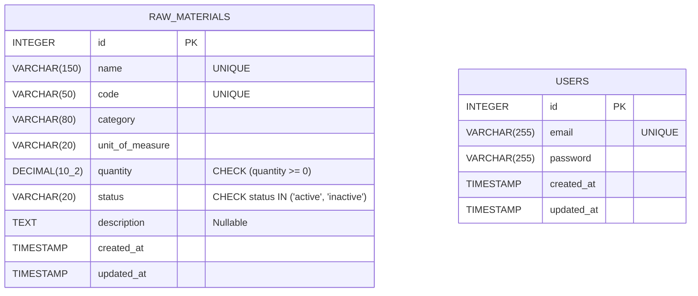

# KosmetikOn - Raw Materials Module

This project implements the "Raw Materials" module for KosmetikOn's inventory management system. It provides a full-stack solution featuring a Node.js backend using Express and Sequelize paired with an Angular frontend.

## Sector Knowledge
** In your own words, what is a raw material in cosmetology? ** 
its any substance that is used in the production of a cosmetic product it can be combined with other subtances to make the final product. 

## Documentation Index

| Component | Path / Link | Description |
| :--- | :--- | :--- |
| **Backend** | [backend/README.md](./backend/README.md) | Details backend architecture, DI, layers, testing rules, and Swagger info. |
| **Frontend** | [frontend/README.md](./frontend/README.md) | Details frontend Angular structure, reactive form logic, and routings. |

## Prerequisites

- **Docker:** Docker Daemon & Docker Compose v2+
- **Manual (Without Docker):** Node.js v18/22+, Angular CLI, PostgreSQL 13+

## Installation and Run

### Option A: With Script (Recommended)

1. Ensure ports **`3000`** (Backend), **`4200`** (Frontend), and **`5432`** (DB) are free.
2. Build and start the containers from the root directory:
```bash
./start.sh
```
3. To stop gracefully and clean up the database volume:
```bash
docker compose down -v
```
### Option B: With Docker (Recommended)

1. Ensure ports **`3000`** (Backend), **`4200`** (Frontend), and **`5432`** (DB) are free.
2. Build and start the containers from the root directory:
```bash
git clone https://github.com/S1nju/kosmetik_technical_test.git

cd kosmetik_technical_test

cp ./backend/.env.example ./backend/.env

cp ./frontend/.env.example ./frontend/.env

docker compose up --build
```
3. To stop gracefully and clean up the database volume:
```bash
docker compose down -v
```

**Access Points:**
- **Frontend UI:** http://localhost:4200
- **Backend API:** http://localhost:3000/api/raw-materials
- **Swagger Docs:** http://localhost:3000/api-docs

*(Note: Docker automatically runs the health checks and initialization scripts located in `/database/01_schema_and_seed.sql` on first boot).*

### Option C: Without Docker (Manual Execution)

**1. Database Initialization:**
```sql
CREATE DATABASE kosmetikon;
-- Then run the /database/01_schema_and_seed.sql script inside it
```

**2. Backend Setup:**
```bash
cd backend
npm install
npm start
```

**3. Frontend Setup (in a new terminal):**
```bash
cd frontend
npm install
npm start
```

## Data Modeling 



## Environment Variables

| Variable | Application | Example Value |
| :--- | :--- | :--- |
| `POSTGRES_DB` | Backend | `kosmetikon` |
| `POSTGRES_USER` | Backend | `postgres` |
| `POSTGRES_PASSWORD` | Backend | `postgres` |
| `POSTGRES_HOST` | Backend | `db` (Docker) or `localhost` (Manual) |
| `POSTGRES_PORT` | Backend | `5432` |

## Technical Decisions
- **Dependency Injection (DI)**: Backend acts as a completely decoupled architecture for easier isolation routing mapping directly to mock objects during test runs.
- **JWT Authentication**: Secured endpoints utilizing robust JSON Web Tokens (`jsonwebtoken`) and `bcryptjs`.