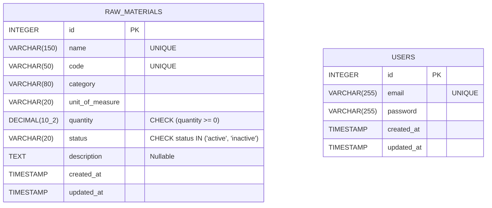

# KosmetikOn - Raw Materials Module

## Project Overview
This project implements the "Raw Materials" module for KosmetikOn's inventory management system. It provides a full-stack solution featuring a robust Node.js backend using Express and Sequelize to strictly enforce cosmetic raw material uniqueness and validation constraints, alongside a responsive Angular frontend equipped with reactive forms for creating, editing, and listing inventory items efficiently.

## Prerequisites

### For running with Docker:
- Docker (Ensure the daemon is running)
- Docker Compose v2 or higher

### For running without Docker (Manuel Execution):
- Node.js (v18 or v22 recommended)
- Angular CLI (latest compatible with your Angular version)
- PostgreSQL (v13 or higher recommended)

## Data Modeling 
Below is our database scheme represented via a Mermaid Entity Relationship Diagram. 

## Relevant Documentation Folders
- **[Backend Documentation](./backend/README.md)**: Details backend project layer structures, specific dependency architecture, and testing procedures.
- **[Frontend Documentation](./frontend/README.md)**: (Coming soon) Will detail the modular UI structure, reactive forms logic, and routing schemas.

## Installation and Run - With Docker
This guarantees the code will run perfectly in an isolated environment without needing local Node.js or Postgres installations.

1. Ensure port `3000`, `4200`, and `5432` are free on your machine.
2. Generate your `.env` file in the `/backend` folder (e.g., matching the vars mapped below).
3. In the repository root, build and start the containers using the command: 
   `docker compose up --build`
   *Note: Our `docker-compose.yml` intelligently implements native container healthchecks (`pg_isready`), ensuring the Node backend pauses and waits for PostgreSQL to successfully boot and sync prior to creating connection instances.*
4. The official Postgres container will automatically load the schema from `/database/01_schema_and_seed.sql` on its very first run initializing the `kosmetikon` database. (If you change schemas and need a reset, tear it down cleanly first).
5. **Accessing the application:**
   - **Frontend UI:** http://localhost:4200
   - **Backend API:** http://localhost:3000/api/raw-materials
   - **Swagger API Docs:** http://localhost:3000/api-docs
6. **To stop and tear down:**
   Press `Ctrl+C` in the terminal to stop gracefully, then definitively clean up existing containers and data networks by running:
   `docker compose down -v`

## Installation and Run - Without Docker

### 1. Database Setup
- Install PostgreSQL, connect via CLI or pgAdmin, and run: `CREATE DATABASE kosmetikon;`
- Execute the manual setup script located in `database/01_schema_and_seed.sql` into the `kosmetikon` database.

### 2. Backend Setup
- Navigate to the backend directory: `cd backend`
- Install dependencies: `npm install`
- Create a `.env` file referencing the Environment Variables listing beneath this section.
- (Optional but recommended over raw SQL scripts): Run the Sequelize migrations and seeders:
  `npm run db:migrate` followed by `npm run db:seed`
- Start the server: `npm start`
- The Backend sits on http://localhost:3000 
- API Documentation is browsable on http://localhost:3000/api-docs

### 3. Frontend Setup
- Open a new terminal and navigate to: `cd frontend`
- Install dependencies: `npm install`
- Ensure Angular's `environment.ts` is pointed at the backend URL `http://localhost:3000/api`.
- Start the UI: `npm start`
- View the UI on http://localhost:4200

## Environment Variables

| Variable Name | Application | Description | Example Value |
| --- | --- | --- | --- |
| POSTGRES_DB | Backend | Target Database Name | kosmetikon |
| POSTGRES_USER | Backend | Postgres user role assigned | postgres |
| POSTGRES_PASSWORD | Backend | Password for the postgres role | [PLACEHOLDER_PW] |
| POSTGRES_HOST | Backend | Hostname for DB routing | db (Docker) or localhost (Manual) |
| POSTGRES_PORT | Backend | Standard DB Port | 5432 |
| NODE_ENV | Backend | Execution Environment | development |

## API Documentation
Once the backend runs correctly, real-time OpenAPI (Swagger) interface interaction becomes immediately available.
Access the API specifications directly at **http://localhost:3000/api-docs**

## Technical Decisions
- **Dependency Injection (DI) & Layered Architecture**: We structured the backend using DI across routes, controllers, services, and repositories. This ensures extreme modularity, separating HTTP framing from core business constraints and isolating DB logic entirely, unlocking seamless Unit Testing abilities using simple mock objects.
- **Sequelize Migrations Over Native Raw SQL**: The original test requirements requested placing a raw initialization script directly in `/database`. To mimic high-tier professional tooling (similar to Laravel's framework), we adopted Sequelize Migrations instead, ensuring code-first version tracking, enabling up/down rollbacks, and allowing scalable automated CI/CD pipeline deployments without risk of synchronization bugs.
- **Express-Validator**: Used for payload data integrity immediately parsing HTTP layer incoming traffic.

## Assumptions
- I assumed the unit of measure is standard and did not introduce an associative lookup table for it, mapping it natively as a simple `VARCHAR(20)`. The same applies to categories for scope boundary logic. 
- It is assumed `npm start` triggers Node implicitly without production bundlers inside Docker for straightforward test reviewing.